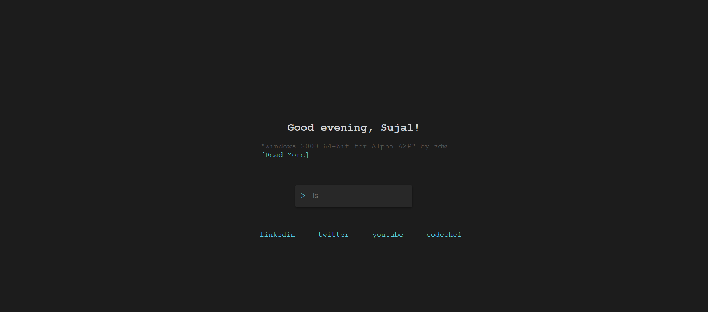
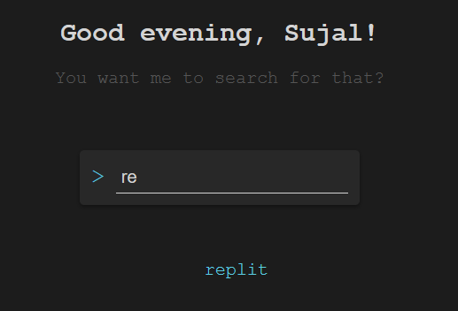

# My Awesome Start Page





This is a customizable browser start page that provides a clean and minimalistic interface for your daily browsing needs.

## Features
- Quick access to your favorite websites
- Dynamic search functionality powered by Google
- Display of latest news articles from Hacker News
- Interactive assistant to provide information and assistance

## Getting Started

### Prerequisites

- Web browser (Chrome, Firefox, Safari, etc.)

### Installation

1. Clone the repository:

   
```bash
git clone https://github.com/SujalChoudhari/StartPage.git
```

2. Navigate to the project directory:
```bash
cd StartPage
```
3. Open `index.html` in your web browser.

## Usage
* Click on a bookmark to open the corresponding website.
* Enter a search query in the input field and press Enter to perform a search.
* The assistant can provide information about the current time and display the latest news articles.

* In settings of browser, set the homepage to `index.html` to open the start page on browser startup.

> 80% of the code in this project is generated using the ChatGPT language model developed by OpenAI.

## License

This project is licensed under the MIT License.